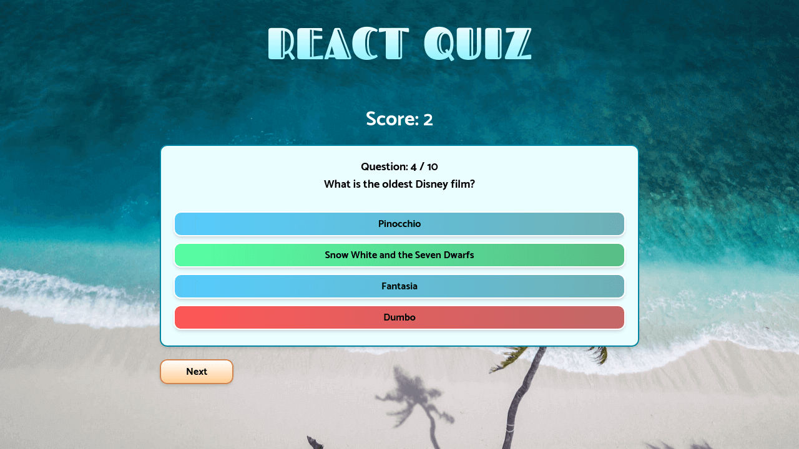

# React Quiz

A simple quiz game, built with TypeScript, React, and Tailwind CSS.

  
Table of Contents

  <ol>
    <li><a href="#description">Description</a></li>
    <li><a href="#live-demo">Live Demo</a></li>
    <li><a href="#built-with">Built With</a></li>
    <li><a href="#todo">Todo</a></li>
    <li><a href="#author">Author</a></li>
    <li><a href="#license">License</a></li>
    <li><a href="#acknowledgements">Acknowledgments</a></li>
  </ol>

## Description

This quiz game promps the user with 10 randomly selected general trivia questions. After the user picks an answer, the game gives immediate feedback whether you were right or wrong, keeping track of your score throughout the game. At the end, you can start a new quiz with a new set of questions.

 

## Live Demo

Preview the live demo: [https://jonrutter-quiz.netlify.app/](https://jonrutter-quiz.netlify.app/)

## Built with

- [TypeScript](https://www.typescriptlang.org/)
- [React](https://reactjs.org/)
- [Tailwind CSS](https://tailwindcss.com/)

## Todo

- Allow users to change the question difficulty level.
- Allow users to change the number of questions.
- Allow users to select a question topic.

## Author

**Jon Rutter**

- [GitHub Profile](https://www.github.com/jonrutter)
- [Email](mailto:contact@jonrutter.io)
- [Website](https://www.jonrutter.io)

## License

This project is licensed under the MIT License. See the LICENSE file for details.

## Acknowledgements

- This project uses the [Open Trivia Database API](https://opentdb.com/) as a source for quiz questions.
- This project was originally built following [Thomas Weibenfalk's tutorial](https://www.youtube.com/watch?v=F2JCjVSZlG0).
